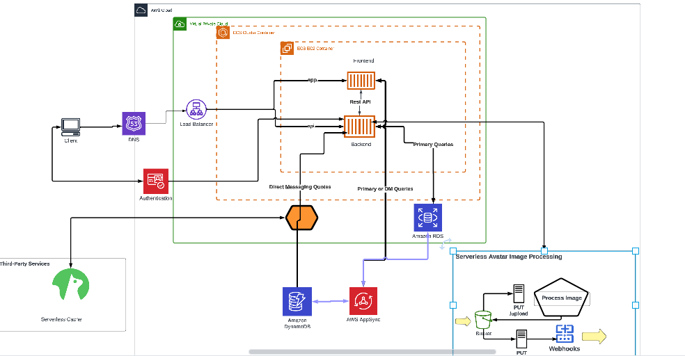

# Week 0 — Billing and Architecture

## required tasks

### Install AWS CLI

At first, i installed the aws cli on my machine before knowing that i had to install it on my gitpod. 

### Create a billing alarm 

the alarm notify me when my spend reaches a certain threshold. 

### Create a budget 

This is the estimated total amount i am willing to spend on a service. This was set to $1

### Create an IAM user

The concept of IAM user is new to me. Created an IAM user using the root user, this IAM user does not have full authorization like the root user 

### Recreate Logical Architectural Design

